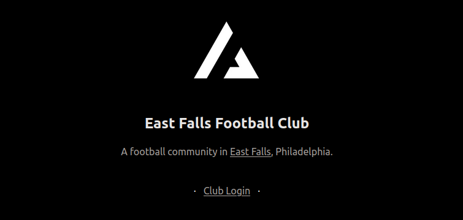
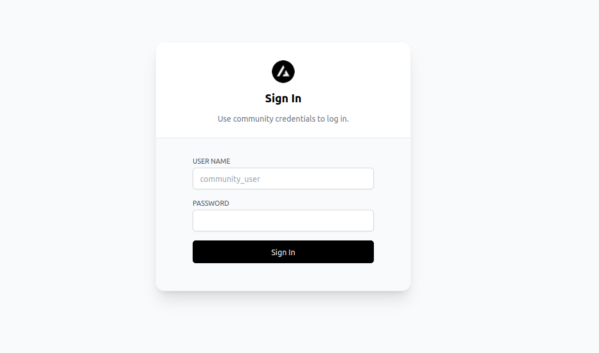
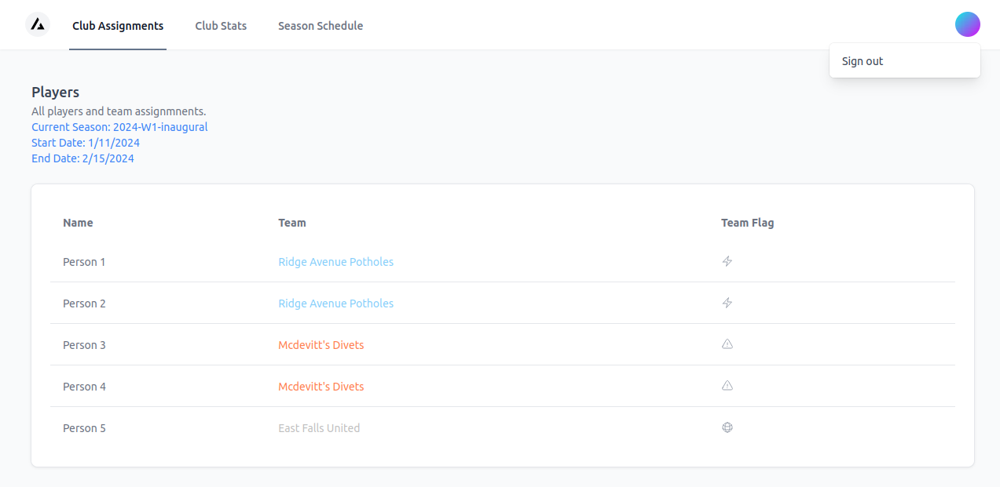
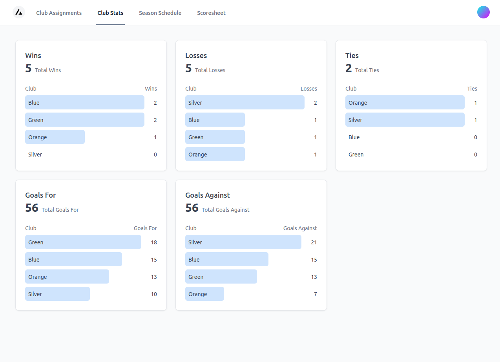
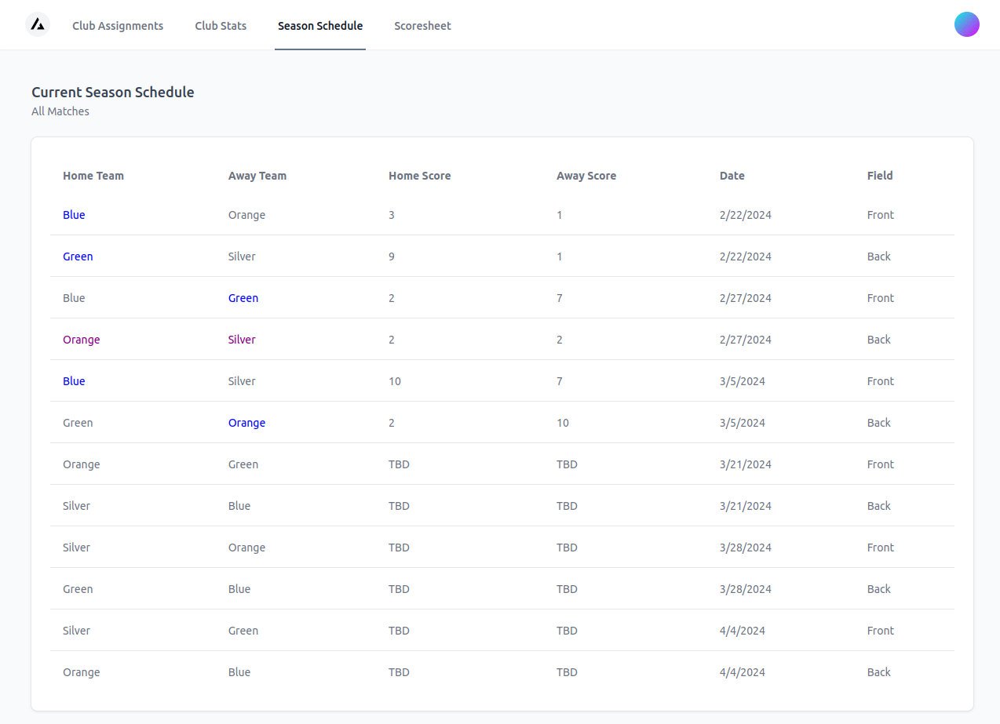
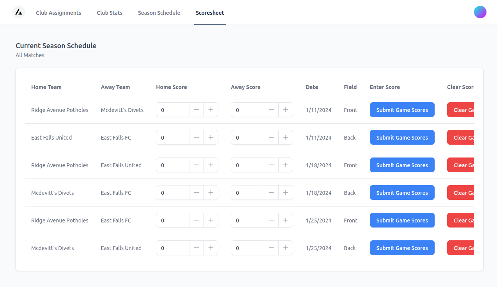

# Football League Dashboard

This houses code used to manage a site for a small football league, which can (currently) be deployed
and hosted completely for free on Vercel. It was developed for use in East Falls Football Club (aka la little liga).

It currently has the following views and functionality:

**Homepage**

  

**Basic two-account authorization/authentication (regular and admin user)**

  


**A dashboard pane showing users and team assignments**

  

**A dashboard pane showing season stats for each team**

  


**A dashboard pane showing game schedule for a season**

  

**An admin-only dashboard pane to enter and edit game scores**


  


# Overview

The repository is currently a minimal modification of the starter template [here](https://github.com/vercel/nextjs-postgres-nextauth-tailwindcss-template).

## Getting Started

### Local Development

1. First, make a copy of the file `.env.local.example` called `.env.local` in the same directory.

    Populate `DEFAULT_USERNAME`, `DEFAULT_PW`, `ADMIN_USERNAME`, `ADMIN_PW`.

    Optionally alter the env var `AUTH_SECRET` with any secret. Definitely do this before any non-local deployment.

2. Run the following to start the development server:

    ```bash
    npm install
    npm run dev
    ```

  You should now be able to access the application at http://localhost:3000.


By default, the development server will use mock data for the table schemas in place
of actually making network calls to a DB.

To use an vercel postgres DB instead:

1. Fill in credentials for a vercel postgres DB pool and set `USE_MOCK_DATA=false` in `.env.local`.

2. Create the tables the app expects to be able to query:

    ```
    // SQL Statements
    CREATE TABLE users (
      id SERIAL PRIMARY KEY,
      name VARCHAR(255) NOT NULL,
      username VARCHAR(255) NOT NULL,
      email VARCHAR(255) NOT NULL
    );

    CREATE TABLE teams (
      id SERIAL PRIMARY KEY,
      name VARCHAR(255) NOT NULL,
      flag_key VARCHAR(30) NOT NULL
      color VARCHAR(15)
    );

    CREATE TABLE seasons (
      id SERIAL PRIMARY KEY,
      name VARCHAR(255) NOT NULL,
      start_date DATE NOT NULL,
      end_date DATE NOT NULL
    );

    CREATE TABLE team_assignments (
      id SERIAL PRIMARY KEY,
      user_id INTEGER REFERENCES users(id),
      team_id INTEGER REFERENCES teams(id),
      season_id INTEGER REFERENCES seasons(id)
    );

    CREATE TABLE games (
      id SERIAL PRIMARY KEY,
      season_id INTEGER REFERENCES seasons(id),
      date DATE NOT NULL,
      home_team_id INTEGER REFERENCES teams(id),
      away_team_id INTEGER REFERENCES teams(id),
      home_team_score INTEGER,
      away_team_score INTEGER
    );

    CREATE TABLE game_stats (
      id SERIAL PRIMARY KEY,
      game_id INTEGER REFERENCES games(id),
      user_id INTEGER REFERENCES users(id),
      goals INTEGER,
      assists INTEGER
    );
    ```

3. Optionally insert rows in the tables if you want the UI to be meaningful:

    E.g.

    ```
    INSERT INTO users (id, email, name, username) VALUES (1, 'me@site.com', 'Me', 'username');
    ```

### Vercel Deployment

We describe how one can deploy the code in this repository to host an instance of this app on Vercel.
As of 3/5/24, this can be done with a Vercel hobby account, completely for free, with no need to enter
any financial information whatsoever. 

1. First, test an optimized production build of your code locally.

    ```bash
    npm run build
    npm run start
    ```

TODO: Add more vercel-specific deployment details.


### TODO

- Currently the DB calls are extremely wasteful and inefficient; state acquired from requests is not lifted up to common ancestor components (TODO).
This is top of mind because the Vercel free tier has read, write and storage limits.

- This app currently has a minimal, extremely simplistic login mechanism for a shared default user account and a shared
admin account. Using an actual auth scheme is on the agenda, assuming the free-tier database limits are sufficient
to allow for per-person-accounts for a league with N players (request read/writes also go up with N...). Ideally want this to remain
deployable for free on e.g. Vercel as a no-cost option for small, informal leagues to use.